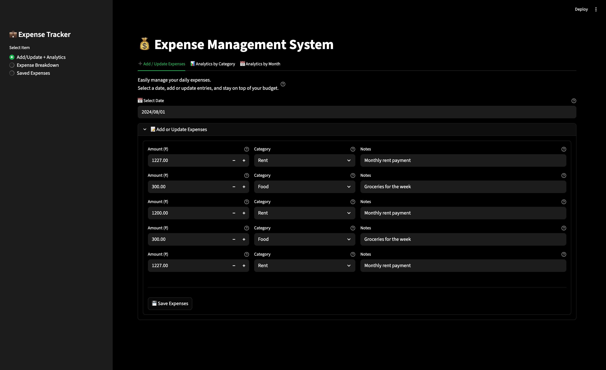
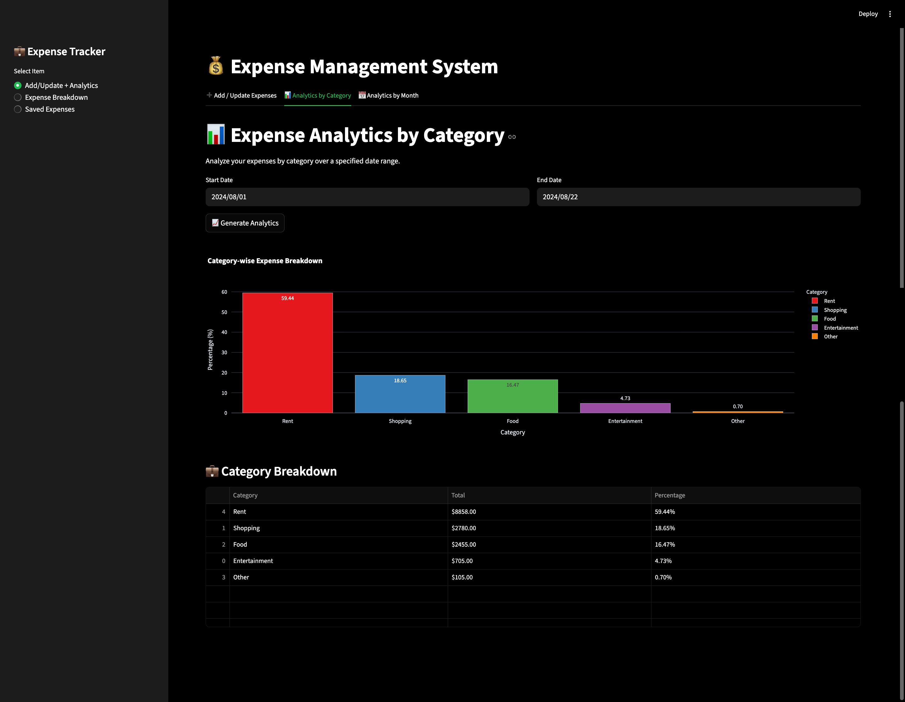
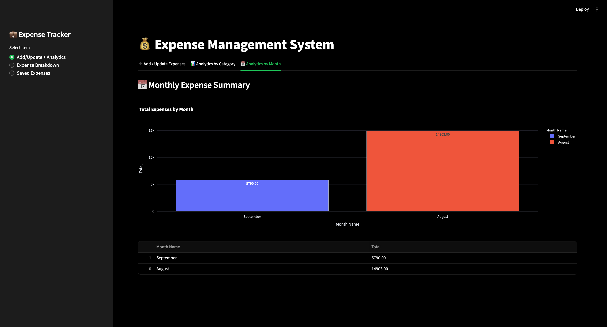
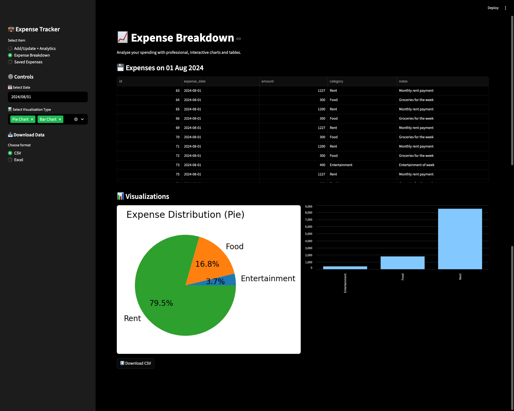

# 🧾 Expense Tracking System

An interactive and modular expense tracking application featuring a **Streamlit** frontend and a **FastAPI** backend. This system enables users to:
	•	📝 Record and manage daily expenses by category
	•	📊 Generate detailed analytics across categories
	•	📆 Explore monthly expense trends with visual insights


---

## 🎥 Presentation
Watch the full project presentation here: **[Expense Tracking System Presentation]

---

## 🛠 Features  
•	Intuitive web interface powered by Streamlit
•	Scalable REST API backend built with FastAPI
•	Categorized expense tracking (Rent, Food, Shopping, Entertainment, Others, etc.)
•	Interactive visualizations for category- and month-wise breakdowns
•	Extendable design for adding new features with ease
•	Structured logging for better debugging and monitoring
•	Backend unit tests to ensure reliability and maintainability
•	Fully runnable in a local development environment

---

## 📂 Project Structure

```
Expense-Tracking-System/
│
├── frontend/  
│   ├── add_update_expenses.py     # Add/update expenses (Streamlit)  
│   ├── analytics_by_category.py   # Category-wise expense analytics  
│   ├── analytics_by_months.py     # Month-wise expense analytics  
│   ├── expense_breakdown.py       # Expense breakdown by date  
│   ├── saved_expense.py           # Manage saved expenses  
│   └── app.py                     # Main Streamlit entry point  
│
├── backend/  
│   ├── db_helper.py               # MySQL database interaction layer  
│   ├── logging_setup.py           # Logging configuration  
│   ├── server.py                  # FastAPI application server  
│   └── server.log                 # Generated logs (can be ignored in VCS)  
│
├── database/  
│   └── expense_db_creation.sql    # MySQL schema and seed data  
│
├── tests/  
│   ├── conftest.py                # Pytest setup  
│   └── backend/  
│       └── test_db_helper.py      # Database helper unit tests  
│
├── LICENSE                        # Apache License  
├── requirements.txt               # Python dependencies  
└── README.md                      # Project documentation  
```

---

## 🚀 How to Run Locally  
### Prerequisites:  
- Python 3.7+
- MySQL 8.0+

1. **Clone the repository**:
   ```bash
   git https://github.com/Ajay998/expense-tracker.git
   cd expense-tracker
   ```
2. **Install dependencies**:   
   ```commandline
    pip install -r requirements.txt
   ```
3. **Set up the MySQL database**
 
   - **Import the schema and sample data:**

     Open **MySQL Workbench**, connect to your MySQL server, and use the following steps to import the database schema:

      1. Go to **File > Open SQL Script**.
      2. Navigate to the SQL file located at `database/expense_db_creation.sql` in the project folder.
      3. Open the file, then click the **Execute** button (⚡) to run the script and create the database with sample data.

   - **Update your MySQL credentials**:  
     Open the file `backend/db_helper.py` and update the following variables with your MySQL username and password:
     
     ```python
     user = "your_mysql_username"
     password = "your_mysql_password"
     ```
4. **Run the FastAPI server**:   
   ```commandline
    uvicorn backend.server:app --reload
   ```
5. **Run the Streamlit app**:   
   ```commandline
    streamlit run frontend/app.py
   ```

---
---

## 🖼️ Project Snapshots

Here are some screenshots of the application in action:

### 🔹 Add/Update Expenses Tab


### 🔹 Analytics by Category


### 🔹 Analytics by Month


### 🔹 Expense Breakdown


---

## 📄 License
This project is licensed under the **Apache License 2.0**. See the [LICENSE](./LICENSE) file for details.

---

*Spend wiser. Track expenses effortlessly.*

